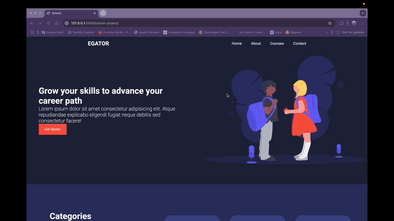

# Egator School Demo

Bu proje, bir okulun tanıtımı amacıyla geliştirilen **Egator School Demo** isimli bir web sitesidir. **HTML** ve **CSS** kullanılarak oluşturulmuş olup **responsive** tasarıma sahiptir.

## ✨ Özellikler
- **Responsive Tasarım**: Mobil, tablet ve masaüstü cihazlarla uyumludur.
- **Okul Tanıtımı**: Okul hakkında genel bilgi, bölümler, eğitim sistemi ve daha fazlası.
- **Modern UI/UX**: Eğitici ve kullanıcı dostu bir tasarım.
- **Temiz Kodlama**: HTML ve CSS ile sade, anlaşılır yapı.

## 📚 Kullanılan Teknolojiler
- **HTML5**
- **CSS3**

## ✨ Kurulum
Projeyi çalıştırmak için aşağıdaki adımları takip edebilirsiniz:

1. Bu repoyu klonlayın:
   ```bash
   git clone https://github.com/kullanici-adin/egator-school-demo.git
   ```
2. Proje klasörüne gidin:
   ```bash
   cd egator-school-demo
   ```
3. `index.html` dosyasını tarayıcınızda açın.

## 🚀 Ekran Görüntüleri


## 👤 Katkıda Bulunma
Projeye katkıda bulunmak isterseniz **pull request** açabilirsiniz.

## 🌐 Canlı Önizleme


---
_Bu proje, yalnızca eğitim amaçlı geliştirilmiştir ve ticari bir amacı yoktur._

